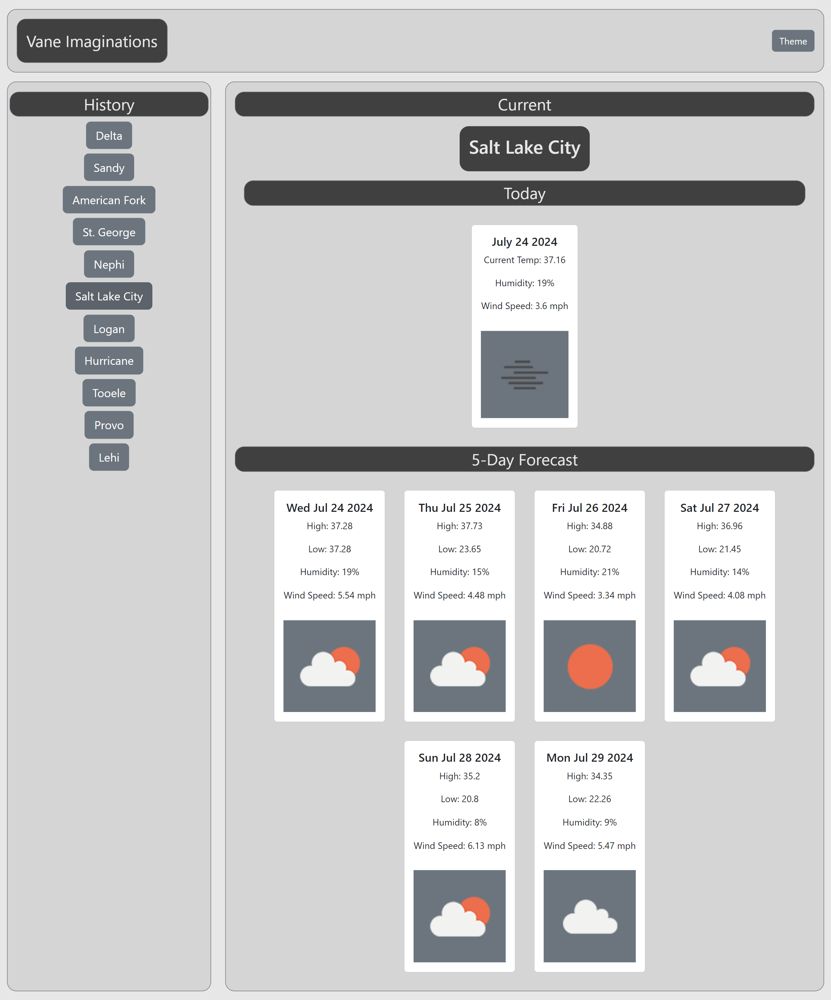

# Orullian-Weather-Dashboard-Module-6-Challenge

[Link to Form](https://jorullian.github.io/orullian-weather-dashboard-module-6-challenge/)

[Link to Forecasts](https://jorullian.github.io/orullian-weather-dashboard-module-6-challenge/query.html)

## Description

This is a weather forecast app that will take in an input of a city name and give the user the current weather and five day forecast for the specific city.  The 15 most recent queries will be stored and can be clicked on the under the 'History' section and their information will then populate the 'Current' section.  There are two pages, a form page where queries can be input and a query page which displays the forecast data.  After submitting the form, the query page will automatically open in a new window.

This website pulls its data from several OpenWeatherMaps API, including its Geolocator (to convert city names into latitude and longitude coordinates), current forecast, and five day forecast.  Each uses a separate URL for its fetch requests.  Thankfully, the data pull is available in JSON, which was used for this site.  

Something I would like to implement in the future is being able to limit the five day forecast cards to five.  Occasionally six cards will be created, this is because the data is separated by day and, depending on when the form is submitted, this can have data from six different days.  An additional feature I would like to include is another form for the query page to make it so users don't have to switch back and forth between pages to keep making queries.  The final feature I would like to include is that every hour or so, the APIs are recalled and the user is given up to date weather information, rather than having to resubmit the form.

With this project, I gained a deep appreciation for good API documentation.  After perusing various APIs for this, and other projects, good documentation is vital for new developers; and unclear and confusing documentation can lead developers to steer away from those APIs.  APIs that are not open-source, should take a close look at their documention and make it clear how it should be implemented.

## Credits

### Libraries

JQuery

Day.js

Bootstrap

### Images

[Photo by Kirill Lazarev](https://www.pexels.com/photo/green-valley-in-alpine-mountains-9801136/)

### API

[OpenWeather Current weather data API](https://openweathermap.org/current)

[OpenWeather 5-day forecast API](https://openweathermap.org/forecast5#limit)

[OpenWeather icon API](https://openweathermap.org/weather-conditions#Weather-Condition-Codes-2)

[OpenWeather Geocoding API](https://openweathermap.org/api/geocoding-api#direct)

## Closing

All code is original and written by Jedediah Craig Orullian.

This project is part of an ongoing coding bootcamp.